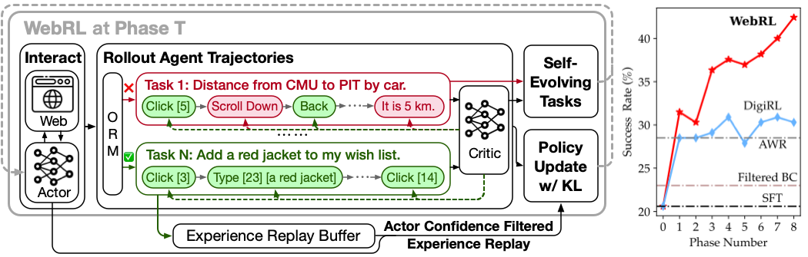

<div align="center">

# WebRL: Training LLM Web Agents via Self-Evolving Online Curriculum Reinforcement Learning

</div>



*Technique adopted in [AutoGLM](https://xiao9905.github.io/AutoGLM/), a series of Phone Use and Web Browser Use Foundation Agents*

***

WebRL, a self-evolving online curriculum learning framework designed for training web agents, targeting the WebArena environment. 

## 🚀 Quick Start

### Dependencies

First, create a conda environment and install all pip package requirements.

```bash
conda create -n webrl python==3.10
conda activate webrl

cd WebRL
pip install -e .
```

### Model checkpoint

The WebRL-GLM-4-9B checkpoint was released here and we use it:

- [WebRL-GLM-4-9B checkpoint](https://huggingface.co/THUDM/webrl-glm-4-9b)

We will also provide the checkpoint of ORM soon.


### Train SFT model

We use LLaMA-Factory to train the SFT baseline, which is the starting model for WebRL. We release the code and data used for training. You can train the SFT baseline with the following commands:

```bash
cd LLaMA-Factory
bash run.sh examples/train_full/llama3_full_policy_web.yaml
```

### Train WebRL

After training the SFT baseline, you should use it as the initial model of the actor and critic.  You can train WebRL with the following commands:

```bash
bash run_multinode.sh
```

This command is used to train the actor and critic in each phase.

### Generating New Instructions

You can generate new instructions with the following commands:

```bash
python scripts/gen_task.py
```

### Interaction and Evaluation

`TODO`: The script for interaction with WebArena is based on [VAB-WebArena-Lite](https://github.com/THUDM/VisualAgentBench/tree/main), with specific modifications set to be published in this week.

## Citation
```
@artical{qi2024webrl,
      title={WebRL: Training LLM Web Agents via Self-Evolving Online Curriculum Reinforcement Learning}, 
      author={Zehan Qi and Xiao Liu and Iat Long Iong and Hanyu Lai and Xueqiao Sun and Xinyue Yang and Jiadai Sun and Yu Yang and Shuntian Yao and Tianjie Zhang and Wei Xu and Jie Tang and Yuxiao Dong},
      journal={arXiv preprint arXiv:2411.02337},
      year={2024},
}
```
